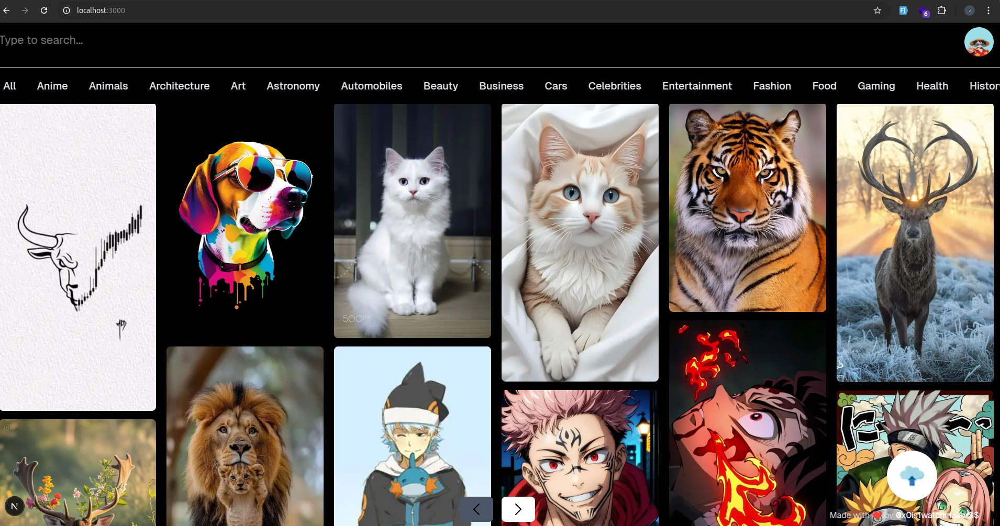
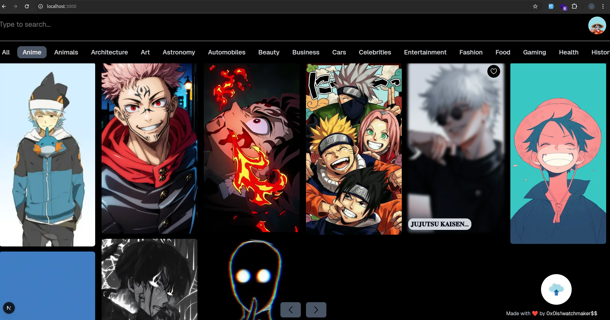
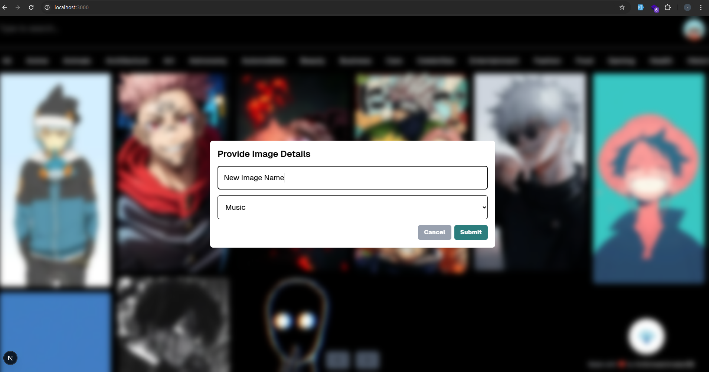

# Photo Album App

The **Photo Album App** allows users to browse through various categories of images and upload their own images to an **AWS S3 bucket**. The app is built with **Next.js** and utilizes **AWS S3** for image storage.

## Features

-   📷 Browse images by categories
-   🔎 Search for images by name
-   ☁️ Upload images to AWS S3
-   📱 Responsive design for different screen sizes

## 🚀 Getting Started

### 📌 Prerequisites

-   **Node.js** (Latest LTS version recommended)
-   **npm, yarn, pnpm, or bun** (for package management)
-   **AWS Account** with an S3 bucket

### 📥 Installation

Clone the repository and install dependencies:

```sh
git clone https://github.com/yourusername/photo-album-app.git
cd photo-album-app
npm install
```

## 🔑 Environment Variables

Create a **.env.local** file in the root directory and add your **AWS credentials** and **S3 bucket** details:

```sh
NEXT_PUBLIC_AWS_ACCESS_KEY_ID=your-access-key
NEXT_PUBLIC_AWS_SECRET_ACCESS_KEY=your-secret-key
NEXT_PUBLIC_AWS_REGION=your-region
NEXT_PUBLIC_S3_BUCKET_NAME=your-bucket-name
```

## 🔧 Running the Development Server

Start the development server:

```sh
npm run dev
```

Then, open [http://localhost:3000](http://localhost:3000) in your browser.
You can start editing the page by modifying **page.tsx**. The page auto-updates as you edit.

## 📦 Building for Production

```sh
npm run build
```

### 🚀 Starting the Production Server

```sh
npm run start
```

## 📁 Project Structure

```
📂 app/         # Main application components and pages
📂 api/         # API routes for handling image uploads and fetching images
📂 components/  # Reusable UI components
📂 constants/   # Application constants
📂 utils/       # Utility functions and configurations
📂 public/      # Static assets
📂 .github/     # GitHub Actions workflows
📂 .next/       # Next.js build output
📄 Dockerfile   # Docker configuration for containerizing the app
📄 package.json # Project dependencies and scripts
📄 tsconfig.json # TypeScript configuration
```

## Shots of The Application

### 1. Landing Page



### 2. Filtered Photos by "Anime" category



### 3. Uploading A new image to S3



## 📚 Learn More

To learn more about **Next.js**, check out the following resources:

-   [📖 Next.js Documentation](https://nextjs.org/docs) – Learn about Next.js features and API.
-   [🎓 Learn Next.js](https://nextjs.org/learn) – An interactive Next.js tutorial.
-   [🛠 Next.js GitHub Repository](https://github.com/vercel/next.js) – Your feedback and contributions are welcome!

## ☁️ Deploy on Vercel

The easiest way to deploy your **Next.js** app is with the **Vercel Platform**, built by the creators of **Next.js**.
Check out the [Next.js deployment documentation](https://vercel.com/docs) for more details.

## 📜 License

This project is licensed under the **MIT License** – see the [LICENSE](LICENSE) file for details.
